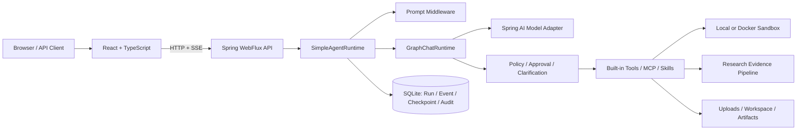
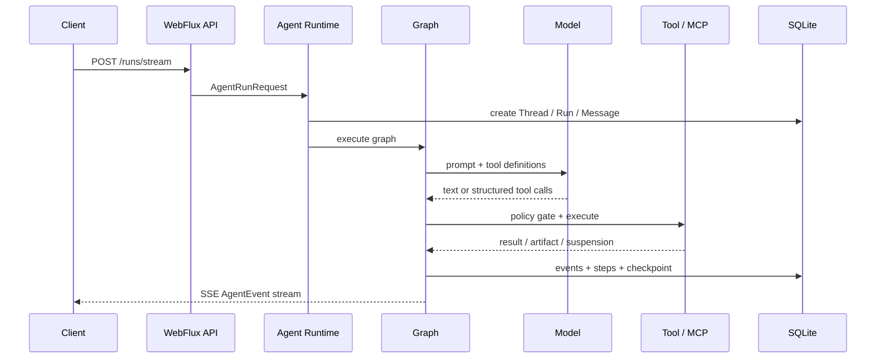

# Haifa AI DeerFlow

[](pom.xml)
[](pom.xml)
[](pom.xml)
[](LICENSE)

面向 Java / Spring 生态的 DeerFlow 风格 Agent Runtime：以可恢复 Graph 为执行主线，将 Tool Calling、MCP、Skills、Deep Research、长期记忆、人工审批、SSE 事件与 SQLite 审计组合成一个可本地运行的完整应用。

> 当前定位是可运行、可阅读、可验证的 Agent 工程实践项目，不是 Python DeerFlow 的等价移植，也不是已完成生产加固的通用平台。已实现范围与限制见[实现状态](deerflow/docs/implementation-status.md)。

> [!NOTE]
> **演示素材待补充**：项目已预留首页截图、Deep Research 录屏和真实模型验证信息的位置。规格见[演示与验证指南](deerflow/docs/demo-and-verification.md#待人工补充的素材)。

## 为什么值得深入看

- **不是单轮 Chat Demo**：一个 Run 会经过上下文组装、模型调用、结构化 Tool Calling、策略门禁、工具执行、最终答案门禁和持久化事件流。
- **执行过程可恢复**：Graph checkpoint 落入 SQLite；clarification / approval 可挂起 Run，并从已保存状态继续执行。
- **研究过程结构化**：Deep Research 不只输出长文本，还维护 plan、work item、source、evidence、claim、citation、quality 和 budget，并生成可下载报告产物。
- **工具接入受治理**：内置 Tool、动态 MCP Tool 和 Skill 共享工具策略、审批、执行预算与审计链路；MCP 使用版本化工具快照和连接级失败策略。
- **有明确安全边界**：提供 `local-restricted`、`local-trusted`、`docker` 三种 Sandbox；默认 YAML 面向可信本地开发，文档明确标出生产环境需要收紧的配置。

## 运行全景



默认 `GRAPH_FIRST` 路径下，`CHAT` 和 `RESEARCH` 都由统一的 `GraphChatRuntime` 驱动；研究模式通过 Deep Research Skill、middleware、observer 与结构化 stores 扩展该执行循环。独立 `GraphResearchRuntime` 已有实现和测试，但当前入口未启用。详见[架构说明](deerflow/docs/architecture.md)。

## 仓库结构

```text
.
├── deerflow/              # Java 21 / Spring Boot Agent Runtime 与 REST/SSE API
├── deerflow-frontend/     # React 19 / TypeScript / Vite 交互界面
└── utility-mcp-server/    # Streamable HTTP MCP Server（/mcp）
```

| 模块 | 建议先看 | 说明 |
| --- | --- | --- |
| Runtime | [`SimpleAgentRuntime`](deerflow/src/main/java/org/wrj/haifa/ai/deerflow/agent/SimpleAgentRuntime.java) / [`GraphChatRuntime`](deerflow/src/main/java/org/wrj/haifa/ai/deerflow/graph/GraphChatRuntime.java) | Run 编排、Graph 路由、SSE、checkpoint 与恢复 |
| Tool / MCP | [`ToolRegistry`](deerflow/src/main/java/org/wrj/haifa/ai/deerflow/tool/ToolRegistry.java) / [`McpConnectionManager`](deerflow/src/main/java/org/wrj/haifa/ai/deerflow/mcp/McpConnectionManager.java) | 内置与动态工具目录、治理、连接生命周期 |
| Deep Research | [`ResearchLoopObserver`](deerflow/src/main/java/org/wrj/haifa/ai/deerflow/research/ResearchLoopObserver.java) | 来源、证据、主张、引用、质量与报告产物 |
| Sandbox | [`sandbox`](deerflow/src/main/java/org/wrj/haifa/ai/deerflow/sandbox) | 命令策略、受限本地执行与 Docker 隔离 |
| Frontend | [`deerflow-frontend/src`](deerflow-frontend/src) | SSE Activity Trace、任务编排、答案与产物工作区 |

## 5 分钟启动

### 环境

- JDK 21
- Maven 3.x
- Node.js + npm（仅前端需要）

默认配置启用 MCP，并把本仓库的 Utility MCP Server 标记为必需连接，因此请按以下顺序启动三个进程。

### 1. 启动 Utility MCP Server

```bash
mvn -pl utility-mcp-server -am spring-boot:run
```

MCP endpoint：`http://127.0.0.1:8091/mcp`

### 2. 启动 DeerFlow Runtime

默认 Web Search / Fetch 使用 Aliyun，启动前还需要设置 `ALIYUN_API_KEY` 或 `DASHSCOPE_API_KEY`。无真实模型配置时，fallback client 只能用于验证启动、API 和界面拓扑；要执行真实 Agent 任务，请使用后面的模型配置。

```powershell
$env:ALIYUN_API_KEY = '<your-search-api-key>'
mvn -pl deerflow -am spring-boot:run
```

- Runtime：`http://localhost:8095`
- 健康检查：`http://localhost:8095/api/deerflow/health`

如果只做无密钥启动检查，可将 Search / Fetch 分别切换为 `duckduckgo` / `jina`，并同时关闭 MCP 的兼容开关和嵌套开关。具体命令见 [Runtime README](deerflow/README.md#无密钥启动检查)。

### 3. 启动前端

```bash
cd deerflow-frontend
npm install
npm run dev
```

打开 `http://localhost:5173`。

### 4. 接入真实模型（OpenAI-compatible 示例）

```powershell
$env:OPENAI_API_KEY = '<your-api-key>'
$env:OPENAI_BASE_URL = '<your-chat-completions-endpoint>'
$env:HAIFA_DEERFLOW_MODEL = '<your-model-id>'
mvn -pl deerflow -am -Popenai spring-boot:run
```

仓库还提供 `google-genai` profile。Gemini 工具调用应使用原生 profile，不要与 `openai` profile 同时启用。完整配置见 [Runtime README](deerflow/README.md#模型接入)。

## 一次请求会发生什么



更细的状态、恢复语义和幂等机制见 [Runtime 执行链路](deerflow/docs/runtime-execution.md)。

## 文档导航

- [DeerFlow Runtime README](deerflow/README.md)：运行、模型、API 与开发入口
- [文档索引](deerflow/docs/README.md)：按阅读目的选择文档
- [实现状态](deerflow/docs/implementation-status.md)：哪些已生效、哪些可选、哪些仍是实验路径
- [架构说明](deerflow/docs/architecture.md)：组件边界和主要数据流
- [Runtime 执行链路](deerflow/docs/runtime-execution.md)：Run、Graph、checkpoint、恢复与幂等
- [Deep Research](deerflow/docs/deep-research.md)：研究数据链和报告生成
- [演示与验证](deerflow/docs/demo-and-verification.md)：可复现演示脚本与待补素材
- [MCP 运维与治理](deerflow/docs/mcp-operations.md)
- [Sandbox Runtime](deerflow/docs/sandbox-runtime.md)
- [Skill / Tool Runtime](deerflow/docs/skill-tool-runtime.md)
- [语音对话](deerflow/docs/voice-conversation.md)

## 验证

```bash
# Runtime 单元与集成测试
mvn -pl deerflow -am test

# Utility MCP Server 测试
mvn -pl utility-mcp-server -am test

# 前端静态检查与构建
cd deerflow-frontend
npm run lint
npm run build
```

真实 Provider、外部搜索和语音服务可能产生费用，不属于默认离线验证路径。

## 当前边界

- 默认 SQLite + 单连接配置更适合单进程、单实例；不是分布式 Runtime。
- 默认 `local-trusted` 允许宿主命令与网络访问，且 approval 关闭，仅适合可信单用户开发环境。
- `ApprovalStore` 当前为内存实现，待审批状态不能跨进程重启恢复。
- Artifact registry 当前是内存状态加 `${userDataRoot}/artifacts.json`，不是数据库表。
- fallback model client 不代表真实模型调用已经验证；公开演示仍需补充实际 Provider、模型和验证日期。

## License

[MIT](LICENSE)
