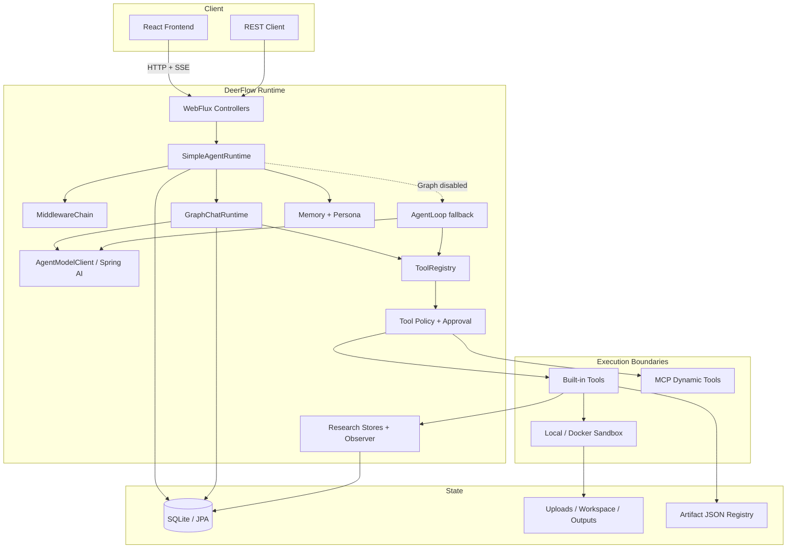

# DeerFlow 架构说明

本文描述 `deerflow` 模块当前生效的架构。事实依据依次为当前入口、配置、源码和自动化测试；保留的实验性 Graph 不作为当前主链路。

## 1. 系统定位

DeerFlow 是一个 Java / Spring Agent Runtime 与应用后端。它通过 WebFlux 暴露 REST / SSE API，把模型推理、工具调用、人工门禁、研究状态和文件产物组织成可观测、可挂起、可恢复的 Run。

三个仓库模块的职责如下：

| 模块 | 职责 | 运行进程 |
| --- | --- | --- |
| `deerflow` | Agent Runtime、REST/SSE、Graph、数据与工具治理 | Spring Boot，端口 `8095` |
| `deerflow-frontend` | 任务输入、SSE Activity Trace、答案和产物工作区 | Vite，端口 `5173` |
| `utility-mcp-server` | 天气、时间、汇率、节假日、计算、百科和 Microsoft Learn 工具 | Spring Boot MCP，端口 `8091` |

## 2. 总体结构



## 3. 分层与边界

### API 层

`web` 包将 HTTP DTO 转换为 Runtime 请求，并保持 SSE 连接。控制器不直接实现 Agent Loop。

主要入口：

- `RunController`：创建、取消、恢复和查询 Run。
- `ThreadController`：Thread、Message 和 Thread 文件视图。
- `UploadController` / `ArtifactController`：上传和产物访问。
- `ApprovalController` / `ClarificationController`：人工交互。
- `MemoryController`：Persona、长期记忆 fact 和 candidate。
- `HealthController`：运行配置与 MCP 快照的脱敏健康视图。

### Runtime 编排层

`SimpleAgentRuntime` 是一次 Run 的应用编排入口，负责：

1. 解析 Thread、RunMode、上传文件和 resume metadata。
2. 创建或恢复 Run，写入用户消息和起始事件。
3. 激活 Skill，初始化研究预算，应用 prompt middleware。
4. 根据 Graph 配置选择 active runtime。
5. 汇聚模型 / 工具事件并完成、挂起、取消或失败 Run。
6. 写入最终消息、报告产物和记忆 reflection。

Runtime 不直接实现具体搜索 Provider、MCP transport 或 Sandbox 进程细节。

### Graph / Loop 层

默认 `GRAPH_FIRST` 使用 `GraphChatRuntime`。其主节点为：

```text
prepare_run
  -> load_context
  -> assemble_model_input
  -> call_model
  -> parse_model_output
     -> final_answer_gate -> finalize
     -> approval_gate -> execute_tools -> clarification_gate -> assemble_model_input
```

Graph 在节点边界记录 checkpoint。需要 clarification 或 approval 时，Run 进入 `SUSPENDED`；恢复请求校验原 Run 与 Thread 后，从 checkpoint 指向的节点继续。

`AgentLoop` 是关闭 Graph 时的兼容路径。`GraphResearchRuntime` 与 `ResearchAgentGraph` 有独立实现和测试，但 `SimpleAgentRuntime` 当前不会把它们作为 research active path；详见[实现状态](implementation-status.md)。

### Model 层

Runtime 面向 `AgentModelClient`，Provider 适配通过 Maven profile 装配：

- `openai`：OpenAI-compatible Chat Completions。
- `google-genai`：Google 原生 GenAI，保留 Gemini 工具调用所需元数据。
- 无真实 Provider：fallback client，仅用于启动和拓扑验证。

模型返回正常文本或结构化 tool calls。Runtime 不从普通文本中猜测或解析伪造的工具调用。

### Tool / MCP / Skill 层

- `ToolRegistry` 合并 Spring Bean 形式的内置 Tool 与当前 MCP snapshot 的动态 Tool。
- `ToolPolicyService` 做工具可见性、模式、风险和能力约束。
- `ApprovalPolicyService` 决定调用是否允许、拒绝或要求人工审批。
- `McpConnectionManager` 管理连接启动、发现、刷新、last-known-good snapshot 和失败状态。
- Skill 是模型指令、脚本、模板和引用资源的包，不是 Spring `AgentTool`；Skill 可引导模型调用现有原子工具。

工具结果会进入事件、tool call / execution 审计和下一轮模型上下文。工具执行幂等服务避免恢复时重复执行已确认完成的同一调用。

### Research 层

`RESEARCH` 不切换到另一套孤立 Runtime，而是在统一 Agent Graph 中：

- 自动激活 `deep-research` Skill。
- 调整最大步数、工具预算和 timeout。
- 通过 observer 与 Tool 写入 plan、work item、source、evidence、claim、citation、quality 和 budget。
- 在完成阶段生成 Markdown report artifact。

完整数据链见 [Deep Research](deep-research.md)。

## 4. 持久化与文件状态

| 状态 | 当前事实源 | 说明 |
| --- | --- | --- |
| Thread / Run / Message / Event | SQLite + JPA | 运行与对话主记录 |
| Model Step / Tool Call / Tool Execution | SQLite + JPA | 推理和工具审计 |
| Graph checkpoint | SQLite checkpoint tables | 节点状态、next node 和外部引用 |
| Research records | SQLite + JPA | plan、source、evidence、claim、citation、quality、budget 等 |
| Memory / Persona | SQLite + JPA | 长期事实、候选记忆和 Persona |
| Upload / Workspace / Output | 本地文件系统 | 位于 `data/user-data` 下 |
| Artifact registry | 内存 + `artifacts.json` | 元数据不是数据库表 |
| Pending approval | 进程内 Store | 不能跨进程重启恢复 |

默认 SQLite 使用 WAL、`busy_timeout=5000` 和 Hikari 单连接，适合本地单实例，不是多实例共享数据库方案。

## 5. 事件与可观测性

SSE 事件与数据库事件使用同一 `AgentEvent` 语义，覆盖 Run、模型、工具、研究、审批、澄清、产物和错误。客户端断开不等于事件丢失，可通过以下接口回查：

- `GET /api/deerflow/runs/{runId}/events`
- `GET /api/deerflow/runs/{runId}/observability`
- `GET /api/deerflow/runs/{runId}/activity`
- `GET /api/deerflow/runs/{runId}/model-steps`
- `GET /api/deerflow/runs/{runId}/tool-calls`
- `GET /api/deerflow/runs/{runId}/tool-executions`

MCP 健康信息只暴露连接状态、快照版本、工具数量和脱敏错误，不返回 token、完整 URL query、Schema 或工具参数。

## 6. 安全边界

当前 `application.yml` 是可信本地开发配置：

- `sandbox.backend=local-trusted`
- 宿主执行与网络开启
- `approval.enabled=false`
- MCP utility connection 默认 required

共享或生产环境至少应：

1. 切换到经审查的 Docker / 远端隔离执行环境。
2. 关闭不必要的宿主命令、脚本语言、网络和环境变量透传。
3. 启用 approval 并为写文件、网络和脚本定义策略。
4. 给 HTTP API 增加认证、授权、租户隔离与限流。
5. 使用密钥系统注入 Provider / MCP 凭据，不写入 YAML、日志或事件。
6. 替换单实例 SQLite、本地文件和内存 approval 状态。

## 7. 进一步阅读

- [Runtime 执行链路](runtime-execution.md)
- [Deep Research](deep-research.md)
- [MCP 运维与治理](mcp-operations.md)
- [Sandbox Runtime](sandbox-runtime.md)
- [Skill / Tool Runtime](skill-tool-runtime.md)
