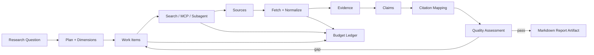

# Deep Research

DeerFlow 的 Deep Research 是统一 Agent Runtime 中的 `RESEARCH` 模式，不是一个只拼接搜索结果的独立接口。它把研究计划、来源、证据、主张、引用、质量与预算保存为可查询数据，并在完成阶段生成报告产物。

## 1. 启动方式

请求入口仍是 `POST /api/deerflow/runs/stream`：

```json
{
  "message": "调研 Java Agent Sandbox 的主要设计路线，给出带引用的简明报告。",
  "mode": "RESEARCH",
  "researchOptions": {
    "depth": "STANDARD",
    "timeWindow": "LATEST",
    "maxSources": 8,
    "requireCitations": true,
    "outputFormat": "REPORT"
  }
}
```

Runtime 会：

1. 把 research options 写入 Run metadata。
2. 自动激活 `deep-research` Skill。
3. 初始化研究时间、步数、来源和 fetch 预算。
4. 通过统一 `GraphChatRuntime` 执行模型与工具循环。
5. 由 research observer 和工具写入结构化研究状态。
6. 完成时生成 Markdown report，并注册为可下载 Artifact。

## 2. 数据链



## 3. 结构化对象

| 对象 | 解决的问题 | 查询接口 |
| --- | --- | --- |
| Plan | 研究目标如何拆分 | `GET /runs/{runId}/plan` |
| Work Item | 每个维度当前做到哪一步 | `GET /runs/{runId}/work-items` |
| Source | 使用了哪些 URL / Provider / 元数据 | `GET /runs/{runId}/sources` |
| Evidence | 从来源中提取了哪些可复用证据片段 | `GET /runs/{runId}/evidence` |
| Claim | 报告提出哪些结论 | `GET /runs/{runId}/claims` |
| Citation | Claim 与 Source / Evidence 如何关联 | `GET /runs/{runId}/citations` |
| Quality | 覆盖率、引用与缺口检查结果 | `GET /runs/{runId}/quality` |
| Budget | 时间、步骤、搜索 / fetch 消耗 | `GET /runs/{runId}/budget` |

这些对象与 Run ID 关联，使前端可以呈现研究过程，而不必从最终 Markdown 反向解析状态。

## 4. 参与组件

### Skill 与 Middleware

`skills/public/deep-research/SKILL.md` 定义模型应遵循的研究步骤和完成要求。Skill 作为提示与资源包进入上下文，不直接成为 Tool。

Research 相关 middleware 会注入预算、进度、来源缺口、Todo、质量反馈和可用工具说明，并在上下文过大时受统一压缩和输出预算约束。

### Observer 与 Stores

`ResearchLoopObserver` 监听模型 / 工具循环，把运行事件映射到研究进度。Plan、Source、Evidence、Claim、Citation、Quality 和 Budget 分别由相应 store 持久化，避免把所有状态塞入一个不可查询的 JSON 字段。

### Tool

研究可使用：

- `web_search` / `web_fetch`。
- Utility MCP 提供的百科、Microsoft Learn 等知识工具。
- evidence、claim、citation、Todo 等研究工具。
- `task` / Subagent 并行处理受控研究维度。
- 文件和脚本工具处理本地材料与生成产物。

所有工具仍经过 `ToolRegistry`、`ToolPolicyService`、approval、执行预算和 tool execution audit；研究模式不会绕过通用安全边界。

### Subagent

`SubagentRuntime` 复用主 Runtime 的模型、工具和审计能力。`SubagentLimitMiddleware` 限制递归深度与并发，防止一个研究任务无界派生子任务。

子任务结果回到父 Run 的研究链路；它不是独立外部进程，也不是绕过父级策略的特殊通道。

## 5. 质量与完成

Deep Research 的完成条件不应只看“模型是否输出一段文本”。运行期会检查：

- 是否达到请求的来源与维度覆盖。
- 是否存在可引用的 Evidence。
- Claim 是否能映射到 Citation。
- 是否仍有未完成或阻塞的 Work Item。
- 是否达到步数、搜索、fetch 或时间预算。
- 是否满足 `requireCitations` 和指定 output format。

质量门禁发现缺口时可以继续研究或重规划；达到预算边界时必须在结果中保留限制，而不是伪造完整性。

## 6. 报告产物

`REPORT` 输出会由 `ReportWriterService` 写入 outputs，并通过 `ArtifactService` 注册。客户端可以从 SSE 的产物事件取得 artifact ID，或查询 Run 后下载：

```text
GET /api/deerflow/artifacts/{artifactId}
GET /api/deerflow/artifacts/{artifactId}/raw
GET /api/deerflow/artifacts/{artifactId}/download
```

Artifact registry 当前是内存加 `data/user-data/artifacts.json`；报告文件、uploads、workspace 和 SQLite 都需要作为独立持久化对象管理。

## 7. 当前边界

- 当前 active research 使用统一 `GraphChatRuntime`。`GraphResearchRuntime` / `ResearchAgentGraph` 不是入口路径，不能用其节点图解释当前全部行为。
- 默认 Aliyun Web Search / Fetch 需要 API Key；DuckDuckGo / Jina 可用于无密钥开发检查，但外部可用性和速率不受本项目保证。
- 引用结构存在不等于每个外部事实已由人工审校；公开报告仍应抽样核验来源质量和 Claim-Citation 对齐。
- 默认最大步数、最大 fetch 数和 timeout 较高，真实 Provider 运行可能产生费用。
- SQLite 和本地文件方案面向单实例；多实例研究调度与分布式队列尚未实现。

## 8. 代码与测试入口

- [`ResearchLoopObserver`](../src/main/java/org/wrj/haifa/ai/deerflow/research/ResearchLoopObserver.java)
- [`SimpleAgentRuntimeGraphFirstResearchTest`](../src/test/java/org/wrj/haifa/ai/deerflow/agent/SimpleAgentRuntimeGraphFirstResearchTest.java)
- [`DeepResearchSkillRuntimeTest`](../src/test/java/org/wrj/haifa/ai/deerflow/persistence/store/DeepResearchSkillRuntimeTest.java)
- [`ResearchQualityGateTest`](../src/test/java/org/wrj/haifa/ai/deerflow/research/plan/ResearchQualityGateTest.java)
- [`ResearchReportNodeTest`](../src/test/java/org/wrj/haifa/ai/deerflow/graph/node/ResearchReportNodeTest.java)
