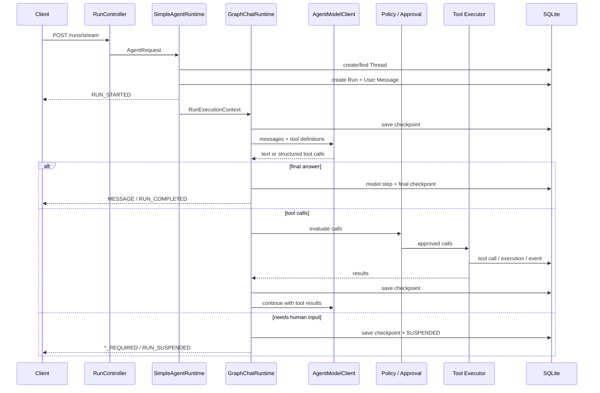
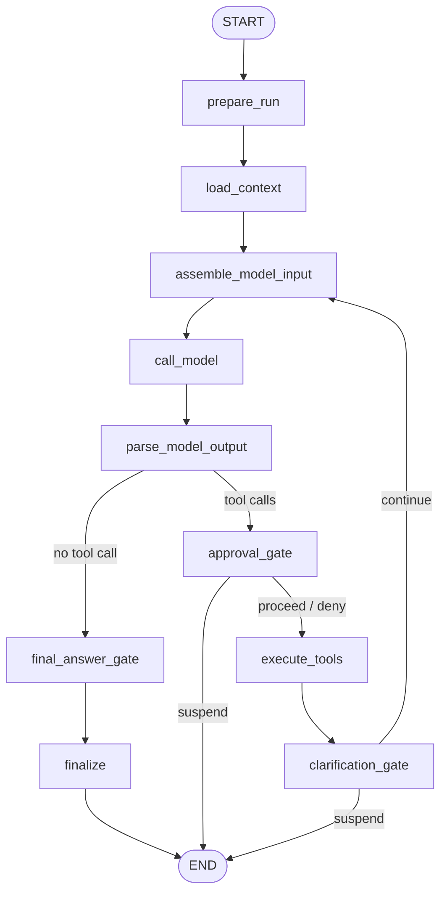

# Runtime 执行链路

本文说明一次请求如何变成可观测、可挂起、可恢复的 Agent Run，以及 Graph checkpoint 和工具幂等分别解决什么问题。

## 1. 运行对象

| 对象 | 作用 |
| --- | --- |
| `Thread` | 多轮对话和文件上下文的容器 |
| `Run` | 一次 Agent 执行，包含模式、模型、状态和 metadata |
| `Message` | User / Assistant 对话记录，并关联 Thread 与 Run |
| `AgentEvent` | SSE 与持久化事件的统一语义 |
| `ModelStep` | 一次模型输入输出摘要和执行状态 |
| `ToolCall` | 模型提出的结构化工具调用 |
| `ToolExecution` | 工具实际执行、结果、耗时与错误 |
| `GraphCheckpoint` | Graph 状态、checkpoint ID、next node 和外部引用 |

Run 的终态包括完成、失败和取消；`SUSPENDED` 是等待 clarification / approval 的可恢复状态。

## 2. 创建与执行



关键步骤：

1. `RunController` 解析 HTTP 请求与用户标识，构造 `AgentRequest`。
2. `SimpleAgentRuntime` 创建 Thread / Run，保存 User Message，分配事件序号。
3. Skill 被解析和激活；`RESEARCH` 自动加入 `deep-research`。
4. `MiddlewareChain` 组装 system prompt、persona、memory、history、uploads、Todo 与预算提示。
5. 默认路由进入 `GraphChatRuntime`；Graph 关闭时进入 `AgentLoop`。
6. 模型输出经结构化 Tool Calling 进入 policy、approval 和 executor。
7. 每个阶段发布 `AgentEvent` 并写入对应审计记录。
8. 最终答案保存为 Assistant Message；研究报告额外注册 Artifact。

## 3. Graph 节点

`GraphChatRuntime` 的 active graph：



`maxIterations` 同时约束循环步数；Graph compile 的 recursion limit 作为额外的执行保护。Research 模式使用独立的最大步骤、工具调用预算和 timeout。

## 4. 挂起与恢复

### Clarification

`clarification` Tool 会创建 clarification record。Graph 在 `clarification_gate` 发布 `CLARIFICATION_REQUIRED` 和 `RUN_SUSPENDED`，checkpoint 保留继续执行所需状态。

恢复顺序：

1. `POST /api/deerflow/clarifications/{clarificationId}/answer` 保存答案。
2. `POST /api/deerflow/runs/{runId}/resume` 读取原 Run、答案和原始用户消息。
3. Runtime 校验该 Run 属于同一 Thread 且状态为 `SUSPENDED`。
4. Graph 从 SQLite 读取原 checkpoint ID 与 next node。
5. 同一个 Run 被标记为运行中，并发布 `RUN_RESUMED`。

### Approval

`approval_gate` 根据 Tool、参数风险和配置做 `ALLOW`、`DENY` 或 `REQUIRE_APPROVAL` 决策。要求审批时保存 pending request 并挂起 Graph；作出决定后由相同 resume endpoint 继续。

当前 `ApprovalStore` 是进程内状态：服务未重启时可完成上述流程；服务重启后虽然 Graph checkpoint 仍在，pending approval 记录不会恢复。这个限制不能被描述为“完整跨重启 HITL 恢复”。

### Legacy fallback 差异

复用原 Run 与 checkpoint 是 active Graph 路径的语义。关闭 Graph 后，legacy `AgentLoop` 没有同样的 Graph checkpoint 恢复模型；resume metadata 会进入兼容流程，并可能创建同 Thread 的新 Run。

## 5. Checkpoint

启用 `haifa.ai.deerflow.graph.checkpoint.enabled=true` 时，`SQLiteCheckpointSaver`：

- 使用 Thread ID 和 Run ID 定位 Graph 执行。
- 保存 checkpoint ID、next node、序列化状态和创建时间。
- 将不适合直接内嵌的状态保存为外部引用。
- 恢复时把 checkpoint ID 与 next node 传回 compiled graph。
- next node 为 `END` 时不再产生可继续执行的 checkpoint。

Checkpoint 解决“从哪一个节点继续、节点状态是什么”；它不自动解决所有外部副作用。因此工具层还需要独立幂等边界。

## 6. 工具执行幂等

`ToolExecutionIdempotencyService` 以以下信息生成 SHA-256 key：

```text
runId + toolCallId + normalizedToolName + hash(normalizedArguments)
```

持久化状态包括 `RESERVED`、`RUNNING`、`SUCCEEDED`、`FAILED`、`CANCELLED` 和 `UNKNOWN_OUTCOME`。

| 已有状态 | 决策 |
| --- | --- |
| `SUCCEEDED` | 返回已保存结果，不再次执行 |
| `RESERVED / RUNNING / UNKNOWN_OUTCOME` | 标记未知结果；高风险调用阻止自动重试 |
| 高风险失败 | 要求显式重试授权 |
| 可安全重试的普通失败 | 重新 reserve 后执行 |

这样可以避免“Graph 已执行工具，但进程在保存后续 checkpoint 前中断”导致的盲目重复副作用。未知结果不会伪装成成功。

## 7. 取消、超时与失败

- `POST /api/deerflow/runs/{runId}/cancel` 记录取消意图，并通知正在运行的 Graph task。
- Graph 在启动、模型 / 工具阶段和收尾前检查取消状态。
- Runtime 使用最大步数、最大工具调用数和 timeout 形成执行预算。
- 异常写入失败事件与 Run 状态；错误消息不得包含 API Key、完整 Prompt 或原始 Provider 响应。
- SSE 每 10 秒发送 keep-alive comment；断开连接后仍可从事件查询接口读取持久化记录。

## 8. 观测与验证

推荐按同一个 `runId` 联合查看：

```text
GET /api/deerflow/runs/{runId}
GET /api/deerflow/runs/{runId}/events
GET /api/deerflow/runs/{runId}/observability
GET /api/deerflow/runs/{runId}/model-steps
GET /api/deerflow/runs/{runId}/tool-calls
GET /api/deerflow/runs/{runId}/tool-executions
```

对应的确定性测试入口：

- [`GraphChatRuntimeTest`](../src/test/java/org/wrj/haifa/ai/deerflow/graph/GraphChatRuntimeTest.java)
- [`SQLiteCheckpointSaverTest`](../src/test/java/org/wrj/haifa/ai/deerflow/graph/checkpoint/SQLiteCheckpointSaverTest.java)
- [`ToolExecutionIdempotencyServiceTest`](../src/test/java/org/wrj/haifa/ai/deerflow/tool/execution/ToolExecutionIdempotencyServiceTest.java)
- [`AgentLoopApprovalGateTest`](../src/test/java/org/wrj/haifa/ai/deerflow/approval/AgentLoopApprovalGateTest.java)
